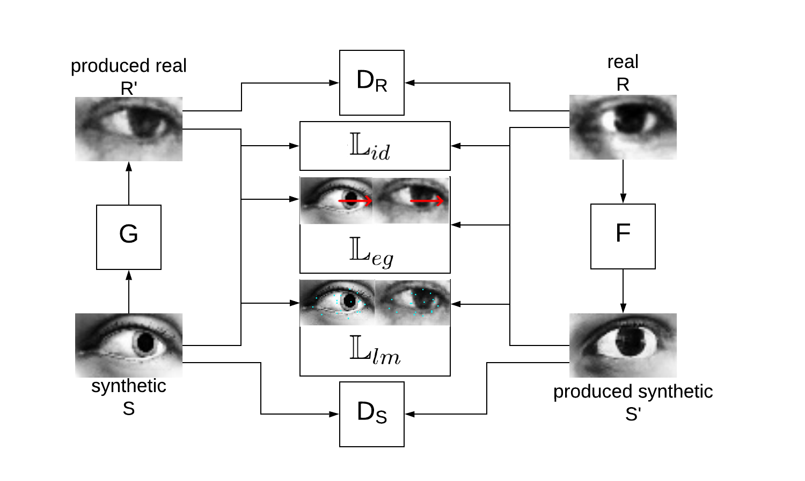
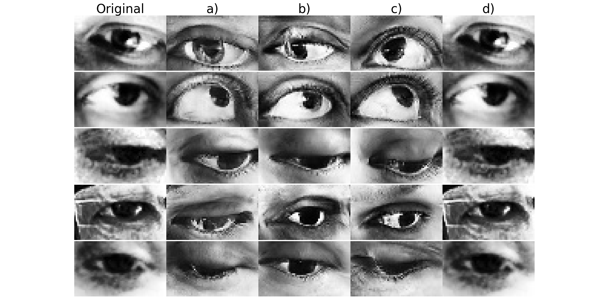

# FP-GAN TensorFlow
This repository contains a re-implementation of the model proposed by Lee et al. (2018) in their paper "Unpaired image-to-image translation using cycle-consistent adversarial networks".

As an extension, we added a feature preserving cost function. We preserve eye gaze directions, as well as regional landmarks when training the image translation networks.

A report explaining this method in detail will be uploaded soon.

## Overall Architecture



## Qualitative Results



## Quick Start
For more detailed step by step instructions see below.
1. Download the datasets: MPIIFaceGaze and UnityEyes
2. Create a config file for the FP-GAN
3. (optional) Train the feature consistency models for eye gaze and/or landmarks consistency
3. Train an FP-GAN model
4. Translate images
5. (optional) Create a config file for a gaze estimator. Then, train a gaze estimation network and run inference.


## Folder Structure
The `src` folder contains the following sub-folders.

* input: dataset classes and preprocessing scripts
* models: eye gaze estimation models, GAN models (Generator, Discriminator, Feature Models) and scripts for model export / inference
* run: scripts for running model training, inference, testing, visualisations
* util: various helper scripts
* visualisations: various visualisation scripts

## Setup
1. Download and prepare the datasets
1.1 Download the ready-to-use dataset for [MPIIFaceGaze](https://www.mpi-inf.mpg.de/departments/computer-vision-and-multimodal-computing/research/gaze-based-human-computer-interaction/its-written-all-over-your-face-full-face-appearance-based-gaze-estimation/) dataset from [here](...).
As an alternative, you can pre-process the data yourself. Download it from the [MPIIFaceGaze website](https://www.mpi-inf.mpg.de/departments/computer-vision-and-multimodal-computing/research/gaze-based-human-computer-interaction/its-written-all-over-your-face-full-face-appearance-based-gaze-estimation/) and convert it to an h5 File with one group per person (e.g. 'p01'). For each per person add a sub group for "image" (the eye image), "gaze" (the gaze direction in 2D) and "head" (the head pose in 2D). You can find the pre-processing script that we used in our experiments on [Bitbucket](https://bitbucket.org/swook/preprocess4gaze).
1.2 Download the ready-to-use UnityEyes dataset from [here](...).
If you want to generate your own UnityEyes dataset, download [UnityEyes](https://www.cl.cam.ac.uk/research/rainbow/projects/unityeyes/) and follow their instructions. We recommend a size of at least 100,000 images.
2. Copy the [sample config file](config/fpgan_example.ini) for the FP-GAN or update it to your needs.

3. Download the pre-trained models for feature consistency or optionally, train the feature consistency models for eye gaze and/or landmarks consistency.
 * Download link for [eye gaze estimator]()
 * Download link for [landmarks detector]()

3. Train an FP-GAN model

Example command:
```python run/train_fpgan.py --config ../config/fpgan_example.ini --section DEFAULT```

4. Translate images
4.1 Update the config file
Before running the image translation, you need to update the config file with the newly trained model.

We recommend copying the DEFAULT section and giving it a new name, e.g. `MYFPGAN`.
Then, set the `checkpoint_folder` variable to the newly trained model.
For example:
```checkpoint_folder=../checkpoints/20190113-1455```
4.2 Run the translations
This will create subfolders in the FP-GAN checkpoint folder. Those subfolders will contain the refined images.
```python run/run_fpgan_translations.py
    --config ../config/fpgan_example.ini
    --section MYFPGAN
    --direction both
```

5. (optional) Train your own gaze estimator or use the pre-trained one from above in order to estimate eye gaze performance.
For this you need to set the `path_test` and `dataset_class_test` in the config file and run the test script. Again, we recommend to copy the `DEFAULT` section for this.

```
path_test =  ../checkpoints/20190113-1455/refined_MPII2Unity
dataset_class_test = refined
```
Run the script:
```python run/run_test_gazenet.py --config ../config/gazenet_example.ini --section MYGAZENET```

## Feedback
I am happy to get your constructive feedback. Please don't hesitate to contact me if you have comments or questions. Thank you.


## References

* LEE , K., KIM , H., AND SUH , C. 2018. Simulated+unsupervised learning with adaptive data
generation and bidirectional mappings. In International Conference on Learning Represen-
tations.
* ZHU, J., PARK, T., ISOLA, P., AND EFROS, A. A. 2017. Unpaired image-to-image translation
using cycle-consistent adversarial networks. CoRR abs/1703.10593.
* CycleGAN paper: https://arxiv.org/abs/1703.10593
* Official CycleGAN source code in Torch: https://github.com/junyanz/CycleGAN
